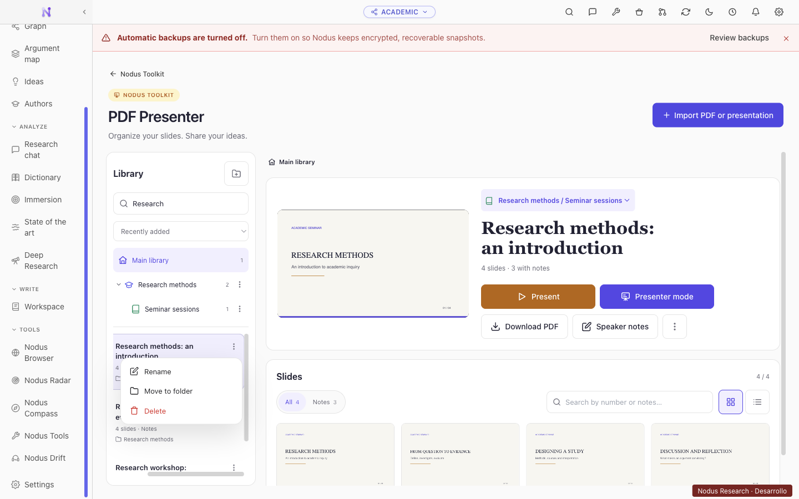
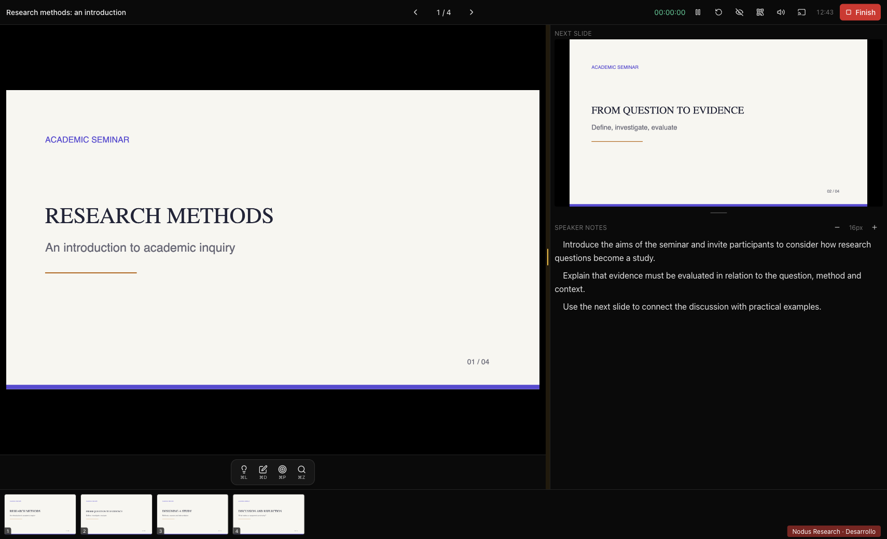

# PDF Presenter

PDF Presenter keeps a local library of imported presentation copies, independent
of the active vault. Open it from **Nodus Toolkit → PDF Presenter**.

## Organizing presentations

- **Main library** shows presentations that are not assigned to a folder.
- Create a folder with the folder-plus button. Folders can contain subfolders;
  edit their name, icon, color or parent from their **⋮** menu.
- Searching the main library includes every nested folder. Searching inside a
  folder includes its descendants. Each search result displays its folder path.
- Use a presentation's **⋮** menu to rename it, move it or delete its library
  copy. The move dialog includes the main library and full paths to nested folders.
- Drag a presentation onto a folder or the main library to move it. The target
  is highlighted. Holding the presentation over a collapsed folder expands it
  so that its subfolders can become the destination.
- Deleting a folder also removes its subfolders. The confirmation dialog offers
  to keep their presentations in the main library or delete their library copies.
  Keeping presentations preserves their notes and video overlays. Source files
  are not deleted.

## Presenting

**Present** opens the audience view. **Presenter mode** opens the presentation
controls, current slide, next slide and speaker notes. Both actions use the same
button height and equally sized primary buttons in the library workspace.

Drag the vertical separator to resize the right sidebar. Drag the horizontal
separator to adjust the next-slide preview and notes area. Focused separators
also support arrow keys, Home and End; double-click restores the default split.
Both slide previews fit their available space while preserving their aspect ratios.

Speaker-note paragraphs have a first-line indent. Presenter, audience and mobile
remote views use the application's shared tooltip styling. The remote connection
control uses a QR-code icon.

## Storage and compatibility

The library metadata is stored in `userData/toolkit/presenter/library.json`,
alongside the imported PDF copies. Legacy `tags`/`tag` records migrate to
`folders`/`folderId` records when normalized and saved. Names, memberships,
speaker notes and video overlays are retained. Invalid parents, folder cycles
and orphaned memberships are repaired during normalization.

Folder deletion is handled in the main process with an explicit keep-or-delete
policy. It saves the updated metadata before removing only the affected library
PDF copies. Moving presentations changes their folder membership; it does not
rewrite their PDFs, notes or video overlays.

These workspace changes add no network access and do not change the existing
local remote-control server or its connection permissions.
