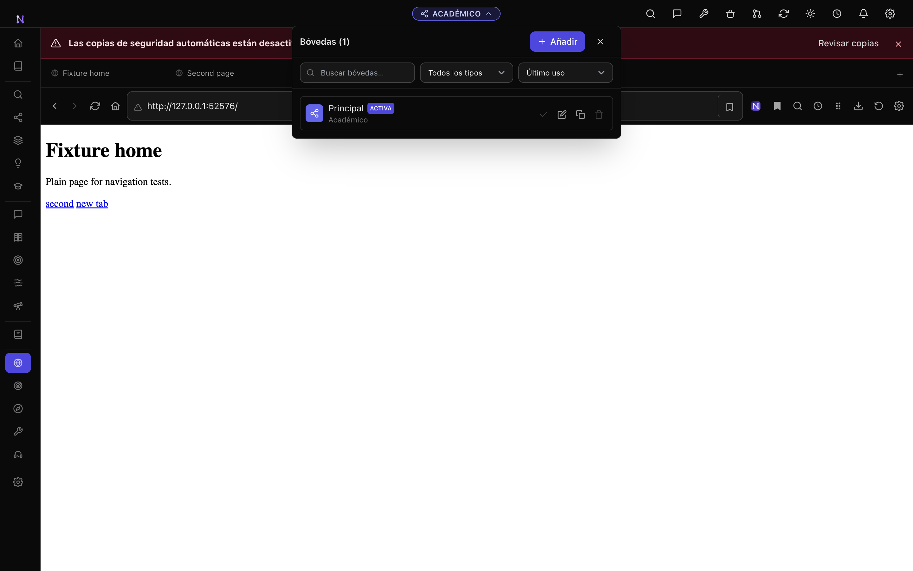
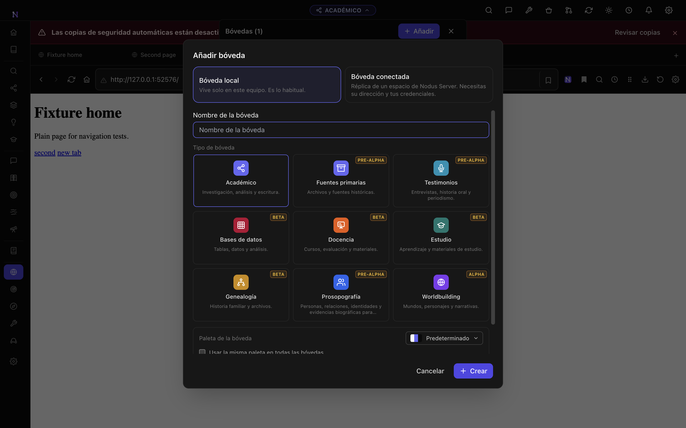

# Browser overlay and sidebar layout verification

Verified on Nodus 5.7.4 with Electron 43.4.0 on macOS arm64, using an isolated
profile and a local HTTP fixture. These screenshots contain synthetic test
content.

## Visible behavior

Opening the vault switcher preserves a frozen image of the website behind the
menu. The image stays in the browser viewport while a child dialog is open and
until the last overlay closes. The native page then returns before the image is
removed. Website execution and media playback continue while the image is shown.

Dragging the sidebar across the native browser boundary keeps the resize handle
in control of the pointer. Native page bounds are updated before the next frame;
keyboard resizing uses the same geometry update. The backing image fills the
viewport and follows layout changes while an overlay is open.

## Regression checks

- `scripts/test-browser-overlays.mjs` checks capture/decode ordering, overlapping
  overlays, rapid close/reopen, cancellation when leaving Browser, and protection
  of app dialogs when capture fails.
- `scripts/e2e-browser.mjs` verifies decoded page imagery behind the vault menu
  and its child dialog, native visibility restoration, and native bounds during
  pointer and keyboard sidebar resizing in the real Electron app.
